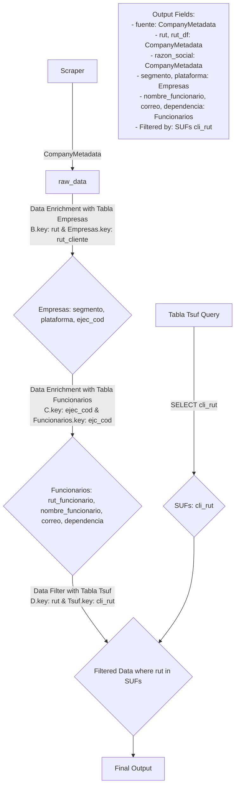

# Modelo de Datos - Scraper Fiscalía

## Diagrama de Flujo

## Descripción del Flujo

### 1. Extracción de Datos (Raw Data)
- **Fuente**: Scrapers (Registro de Empresas y Diario Oficial)
- **Modelo**: CompanyMetadata (definido en models.py)
- **Campos**: fuente, rut, rut_df, razon_social, url, actuacion, nro_atencion, cve, pa_date, fecha_actuacion

### 2. Enriquecimiento de Datos

#### 2.1 Tabla Empresas
- **Tipo**: Data Enrichment
- **Join**: raw_data.rut = empresas.rut_cliente
- **Campos agregados**: segmento, plataforma, ejec_cod
- **Base de datos**: bd_in_tablas_generales.tbl_maestro_empresas

#### 2.2 Tabla Funcionarios
- **Tipo**: Data Enrichment
- **Join**: empresas.ejec_cod = funcionarios.ejc_cod
- **Campos agregados**: rut_funcionario, nombre_funcionario, correo, dependencia
- **Base de datos**: bd_dlk_bcc_tablas_generales.tbl_base_funcionarios

#### 2.3 Tabla SUFs
- **Tipo**: Data Filter
- **Join**: enriched_data.rut IN sufs.cli_rut
- **Función**: Filtrar solo RUTs que están en la tabla SUFs
- **Base de datos**: bd_in_gesdatos.tbl_tsuf_pcp

### 3. Dataset Final
El dataset final contiene solo los registros cuyos RUTs están presentes en la tabla SUFs, enriquecidos con información empresarial y de funcionarios.

#### Campos del Output Final:
| Campo | Origen | Descripción |
|-------|--------|-------------|
| fuente | CompanyMetadata | Origen del dato (empresa/diario_oficial) |
| rut | CompanyMetadata | RUT de la empresa |
| rut_df | CompanyMetadata | Dígito verificador del RUT |
| razon_social | CompanyMetadata | Razón social de la empresa |
| url | CompanyMetadata | URL de la fuente |
| actuacion | CompanyMetadata | Tipo de actuación |
| nro_atencion | CompanyMetadata | Número de atención |
| cve | CompanyMetadata | Código CVE |
| pa_date | CompanyMetadata | Fecha de procesamiento |
| fecha_actuacion | CompanyMetadata | Fecha de la actuación |
| segmento | Empresas | Segmento empresarial |
| plataforma | Empresas | Plataforma empresarial |
| ejec_cod | Empresas | Código de ejecutivo |
| rut_funcionario | Funcionarios | RUT del funcionario |
| nombre_funcionario | Funcionarios | Nombre del funcionario |
| correo | Funcionarios | Email del funcionario |
| dependencia | Funcionarios | Dependencia del funcionario |

## Implementación Técnica

### Queries SQL
1. **Empresas**: Query con ROW_NUMBER() para obtener registros más recientes por RUT
2. **Funcionarios**: Query con JOIN a tabla de códigos ejecutivo y ROW_NUMBER()
3. **SUFs**: Query simple SELECT * FROM tabla SUFs

### Proceso de Merge
1. Merge empresas con funcionarios (LEFT JOIN por ejec_cod)
2. Merge resultado con raw_data (RIGHT JOIN por rut)
3. Filtrar resultado final usando SUFs (WHERE rut IN sufs_list)

### Validaciones
- Verificar que el número de registros se mantenga después del enriquecimiento
- Validar integridad de las claves de unión
- Logging detallado de cada paso del proceso